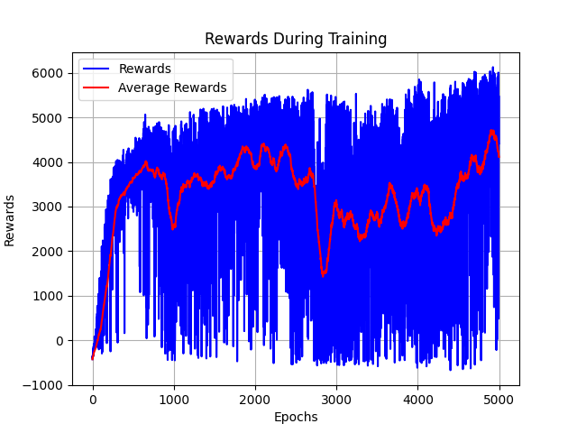

# PPO Implementation for Continuous and Discrete Control

This repository contains a PyTorch implementation of the Proximal Policy Optimization (PPO) algorithm. The implementation is designed to be clear, easy to understand, and applicable to a variety of reinforcement learning environments from the Gymnasium library, supporting both continuous and discrete action spaces.

## Table of Contents
- [Introduction to Reinforcement Learning](#introduction-to-reinforcement-learning)
- [Proximal Policy Optimization (PPO)](#proximal-policy-optimization-ppo)
  - [Policy Gradients](#policy-gradients)
  - [Trust Region Methods and the Surrogate Objective](#trust-region-methods-and-the-surrogate-objective)
  - [The Clipped Surrogate Objective](#the-clipped-surrogate-objective)
  - [The Full Objective Function](#the-full-objective-function)
- [Implementation Details](#implementation-details)
  - [Network Architecture](#network-architecture)
  - [Training Loop](#training-loop)
- [Results](#results)
  - [HalfCheetah-v5](#halfcheetah-v5)
- [How to Use](#how-to-use)
  - [Setup](#setup)
  - [Training](#training)
  - [Testing and Recording](#testing-and-recording)
- [Hyperparameters](#hyperparameters)

## Introduction to Reinforcement Learning

Reinforcement Learning (RL) is a paradigm of machine learning where an agent learns to make decisions by performing actions in an environment to maximize a cumulative reward. The agent learns from the consequences of its actions, rather than from being explicitly taught, making RL a powerful tool for solving problems that require sequential decision-making.

This project focuses on policy-based methods, a class of RL algorithms that learn a policy, which is a mapping from a state to an action. Specifically, we implement Proximal Policy Optimization (PPO), a state-of-the-art policy gradient method.

## Proximal Policy Optimization (PPO)

PPO is a policy gradient method that optimizes the policy by taking steps that are large enough to be efficient but small enough to avoid performance collapse. It achieves this by using a clipped surrogate objective function, which constrains the policy updates to a "trust region."

### Policy Gradients

Policy gradient methods directly optimize the policy by estimating the gradient of the expected total reward with respect to the policy parameters. The basic policy gradient objective function is:

\[ L^{PG}(\theta) = \hat{\mathbb{E}}_t \left[ \log \pi_\theta(a_t|s_t) \hat{A}_t \right] \]

Here, \( \pi_\theta(a_t|s_t) \) is the policy (the probability of taking action \(a_t\) in state \(s_t\)), and \( \hat{A}_t \) is an estimator of the advantage function at timestep \(t\). The advantage function \(A(s,a)\) represents how much better an action \(a\) is compared to the average action in a state \(s\).

### Trust Region Methods and the Surrogate Objective

A key challenge with vanilla policy gradients is their sensitivity to the step size. A large step can lead to a bad policy update, from which it can be difficult to recover. Trust Region Policy Optimization (TRPO) addresses this by maximizing a surrogate objective function subject to a constraint on the size of the policy update. The objective is:

\[ \maximize_\theta \quad \hat{\mathbb{E}}_t \left[ \frac{\pi_\theta(a_t|s_t)}{\pi_{\theta_{old}}(a_t|s_t)} \hat{A}_t \right] \quad \text{subject to} \quad \hat{\mathbb{E}}_t \left[ \text{KL}[\pi_{\theta_{old}}(\cdot|s_t), \pi_\theta(\cdot|s_t)] \right] \leq \delta \]

where \( \pi_{\theta_{old}} \) is the old policy before the update. The ratio \( r_t(\theta) = \frac{\pi_\theta(a_t|s_t)}{\pi_{\theta_{old}}(a_t|s_t)} \) is the probability ratio.

### The Clipped Surrogate Objective

PPO simplifies TRPO by using a clipped surrogate objective function, which is easier to implement and has been shown to perform comparably or better. The PPO-Clip objective is:

\[ L^{CLIP}(\theta) = \hat{\mathbb{E}}_t \left[ \min(r_t(\theta)\hat{A}_t, \text{clip}(r_t(\theta), 1-\epsilon, 1+\epsilon)\hat{A}_t) \right] \]

The `clip` function constrains \( r_t(\theta) \) to the range \( [1-\epsilon, 1+\epsilon] \). This clipping discourages large policy updates. The \( \min \) operator ensures that the final objective is a lower bound (pessimistic) on the unclipped objective.

### The Full Objective Function

The full objective function in PPO combines the clipped surrogate objective with a value function loss and an entropy bonus. The entropy term encourages exploration.

\[ L^{CLIP+VF+S}(\theta) = \hat{\mathbb{E}}_t \left[ L_t^{CLIP}(\theta) - c_1 L_t^{VF}(\theta) + c_2 S[\pi_\theta](s_t) \right] \]

-   \( L_t^{VF}(\theta) = (V_\theta(s_t) - V_t^{\text{targ}})^2 \) is the value function loss, a squared-error loss between the predicted value and a target value (often computed using Generalized Advantage Estimation).
-   \( S[\pi_\theta](s_t) \) is the entropy bonus.
-   \( c_1 \) and \( c_2 \) are coefficients.

## Implementation Details

This implementation follows the standard PPO-Clip algorithm with Generalized Advantage Estimation (GAE) for calculating the advantage function.

### Network Architecture

The agent consists of two main components: an Actor network and a Critic network, defined in `Architecture.py`.

#### Actor (`Actor` class)

-   The Actor is a multi-layer perceptron (MLP) that takes the environment's observation as input and outputs the parameters of a probability distribution over the actions.
-   **Continuous Action Spaces**: For continuous control, the Actor outputs the mean and standard deviation of a Normal distribution.
    -   Actions are sampled from this distribution and then passed through a `tanh` function to bound them within the environment's action range.
    -   The implementation correctly adjusts the log probability of the action to account for this `tanh` transformation, which is crucial for stable learning.
-   **Discrete Action Spaces**: For discrete control, the Actor outputs logits for a Categorical distribution.

#### Critic (`Critic` class)

-   The Critic is also an MLP that takes an observation as input and outputs a single value, which is an estimate of the state's value \( V(s) \). This value is used for calculating the advantage.

### Training Loop

The main training logic is in `PPO.py`. The process for each epoch is as follows:

1.  **Data Collection**: The agent interacts with the environment for a certain number of timesteps to collect a batch of experiences (state, action, reward, next_state, done, log_prob, state_value).
2.  **Advantage Calculation (GAE)**: Once enough data is collected, the advantage function is calculated for each timestep using Generalized Advantage Estimation (GAE):

    \[ \hat{A}_t^{GAE}(\gamma, \lambda) = \sum_{l=0}^\infty (\gamma\lambda)^l \delta_{t+l} \]
    where \( \delta_t = r_t + \gamma V(s_{t+1}) - V(s_t) \) is the TD error. This is implemented in a way that iterates backwards over the collected trajectory.

3.  **Policy and Value Function Update**:
    -   The collected data is shuffled and divided into mini-batches.
    -   For each mini-batch, the clipped surrogate objective, value function loss, and entropy bonus are calculated.
    -   The actor and critic networks are updated by performing gradient ascent on the combined PPO objective function. This is repeated for a fixed number of optimization iterations (`NUM_BATCHES` in `hyperparameters.yml`).

## Results

The agent was trained on several environments from the Gymnasium library. Here are some of the results.

### HalfCheetah-v5

**Reward Curve**


**Loss Curves**


### CartPole-v1

**Reward Curve**


**Loss Curves**


### Pendulum-v1

**Reward Curve**


**Loss Curves**


## How to Use

### Setup

1.  **Clone the repository:**
    ```bash
    git clone <repository-url>
    cd <repository-directory>
    ```

2.  **Create a virtual environment:**
    It is recommended to use a virtual environment to manage dependencies.
    ```bash
    python -m venv myenv
    source myenv/bin/activate
    ```

3.  **Install dependencies:**
    You will need to install PyTorch, Gymnasium, and other packages. A `requirements.txt` file is not provided, but you can install the necessary packages using pip.
    ```bash
    pip install torch torchvision torchaudio
    pip install gymnasium[all]
    pip install pyyaml matplotlib
    ```

### Training

To train a new agent, run the `PPO.py` script and provide the path to a hyperparameters file as a command-line argument. For example, to train on the HalfCheetah environment:

```bash
python PPO.py HalfCheetah/hyperparameters.yml
```

-   The script will start training the agent according to the parameters in the specified `.yml` file.
-   During training, it will print the reward for each epoch and the average reward over a sliding window.
-   The best model (based on the average reward) will be saved to the path specified by `MODEL_FILE_NAME` in the hyperparameters file (e.g., `HalfCheetah/HalfCheetah.pt`).
-   Training graphs for rewards and losses will also be saved in the same location.

### Testing and Recording

To test a trained agent and see its performance, run the `test.py` script. This script requires two command-line arguments: the path to the saved model file and the path to its corresponding hyperparameters file.

```bash
python test.py HalfCheetah/HalfCheetah.pt HalfCheetah/hyperparameters.yml
```

-   The script will run the agent for a number of episodes (`NUM_TESTS` in the `.yml` file).
-   It will print a summary of the agent's performance (mean, std, median, min, max score).
-   The raw scores for each run will be saved to a `.csv` file (e.g., `HalfCheetah/HalfCheetahTrainingData.csv`).
-   The performance summary will be saved to a `.txt` file (e.g., `HalfCheetah/HalfCheetahTrainingDataSummary.txt`).
-   A video of one episode will be recorded and saved (e.g., in the `HalfCheetah/` directory).

## Hyperparameters

All hyperparameters for training and testing are managed through `.yml` files. This makes it easy to experiment with different settings for various environments. Each environment has its own directory containing its hyperparameters file.

Here is an explanation of the parameters in `HalfCheetah/hyperparameters.yml`:

-   `env_name`: The name of the Gymnasium environment.
-   `actor_hidden`: A list defining the number of neurons in each hidden layer of the actor network.
-   `std_clamp_min`, `std_clamp_max`: Min and max values to clamp the log of the standard deviation for the action distribution.
-   `critic_hidden`: A list defining the number of neurons in each hidden layer of the critic network.
-   `actor_lr`, `critic_lr`: Learning rates for the actor and critic optimizers.
-   `GAMMA`: Discount factor for future rewards.
-   `LAMBDA`: The \( \lambda \) parameter for Generalized Advantage Estimation (GAE).
-   `EPSILON`: The clip parameter \( \epsilon \) in the PPO objective function.
-   `C1`, `C2`: Coefficients for the value function loss and entropy bonus, respectively.
-   `NUM_EPOCHS`: Total number of training epochs.
-   `BATCH_SIZE`: Mini-batch size for optimization.
-   `NUM_BATCHES`: Number of optimization iterations over the collected data in each epoch.
-   `TRAINING_MIN_SIZE`: The minimum size of the replay buffer before training starts.
-   `LOGGING_FREQ`: How often to print training progress (in epochs).
-   `SLIDING_WINDOW_SIZE`: The size of the sliding window for calculating the average reward.
-   `MODEL_FILE_NAME`: The base path and name for saving the model and graphs.
-   `NUM_TESTS`: The number of episodes to run during testing.
